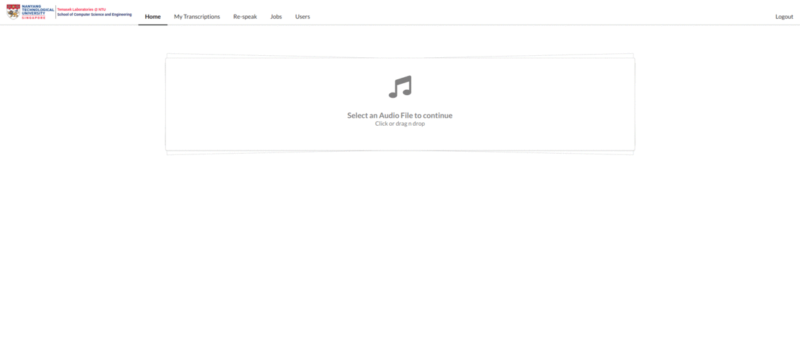

# Transcriptor

A web based transcription editor with wordlevel highlighting support along with speaker tagging.

## Prerequisites

You will need the following things properly installed on your computer.
* Ensure you have the [api server](https://github.com/CosmicCoder96/transcription-server) up and running.
* [Git](https://git-scm.com/)
* [Node.js](https://nodejs.org/) (with npm)
* [Ember CLI](https://ember-cli.com/)
* [Google Chrome](https://google.com/chrome/)
* [Yarn](https://yarnpkg.com/en/)
## Installation

* `git clone <repository-url>` this repository
* `cd transcriptor`
* `yarn`
* cp config/.env.example config/.env
* Ensure `API_HOST` variable is refactored to point to the server where [api server](https://github.com/CosmicCoder96/transcription-server) is running.
## Running / Development
* `ember serve`
* Visit your app at [http://localhost:4200](http://localhost:4200).

### Code Generators

Make use of the many generators for code, try `ember help generate` for more details

### Running Tests

* `ember test`
* `ember test --server`

### Linting

* `npm run lint:hbs`
* `npm run lint:js`
* `npm run lint:js -- --fix`

### Building

* `ember build` (development)
* `ember build --environment production` (production)

### Deploying

Ember build files are stored inside a static directory `dist` located in the root directory of the project.
The `index.html` can be served by a server like Nginx. 

## Important note
The project uses a customised version of the npm package [waveform playlist](https://github.com/naomiaro/waveform-playlist). The source code of the customized package is stored [here](https://github.com/CosmicCoder96/waveform-playlist).
Changes which require modification of the library, should be made to this fork. The package then needs to be republished, and reinstalled to reflect the changes.

